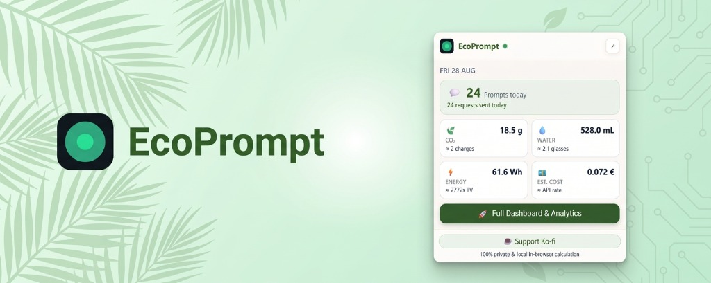
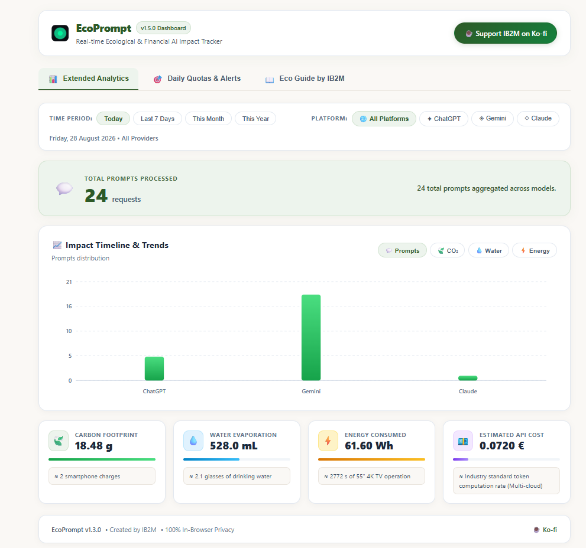
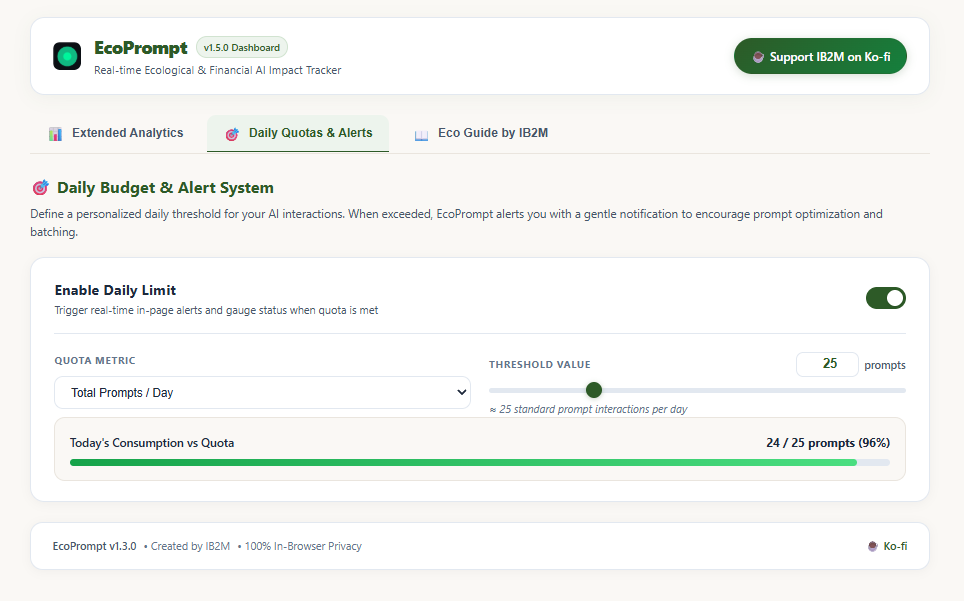
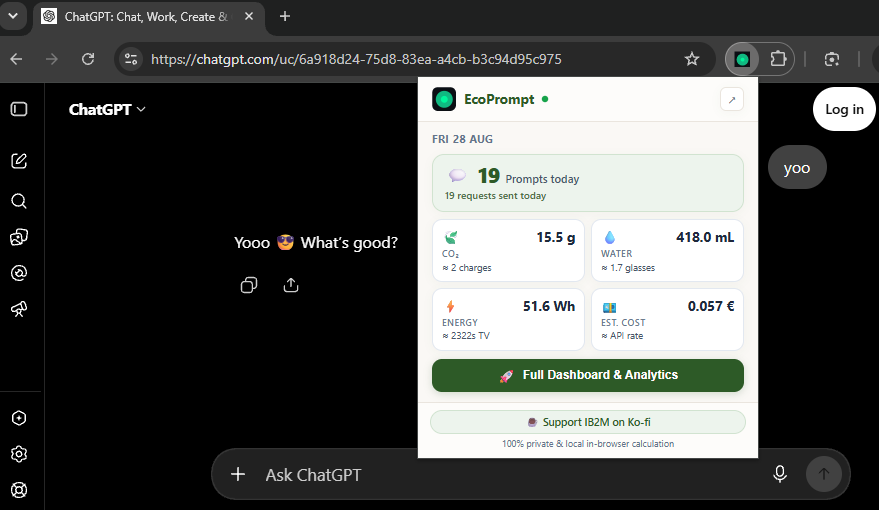
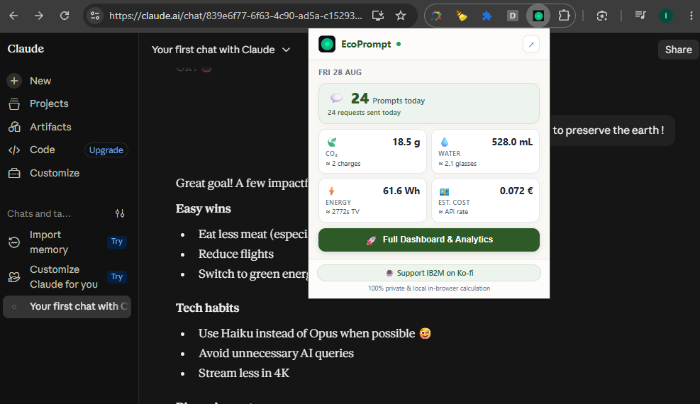
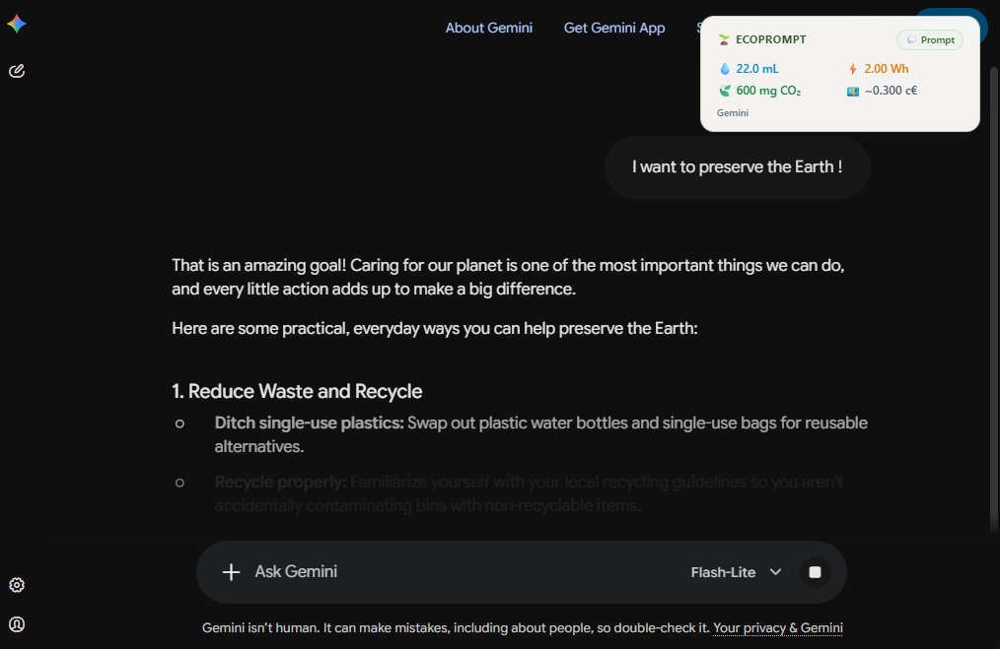

# 🌿 EcoPrompt — AI Ecological & Financial Impact Tracker

<p align="center">
  
</p>

<p align="center">
  <strong>Make the invisible physical and financial cost of Generative AI visible.</strong><br>
  A lightweight, zero-knowledge Chrome Extension (Manifest V3) that estimates the carbon footprint, water evaporation, electricity draw, and API cost of your AI prompts in real time.
</p>

<p align="center">
  
  
  
  
  <a href="https://ko-fi.com/ib2m_official"></a>
</p>

## 📸 Preview Gallery

<p align="center">
  
</p>
<p align="center">
  
  
</p>
<p align="center">
  
  
  
</p>

---

## ✨ Features

- **⚡ Real-Time In-Page Toasts:** Instant ecological receipt upon prompt submission with glassmorphism botanical design.
- **🏛️ The 4 Impact Pillars:**
  - 🍃 **Carbon Footprint (g CO₂):** Grid-weighted emissions model per token sequence.
  - 💧 **Water Consumption (mL):** Direct data-center cooling tower evaporation + thermoelectric power plant water use.
  - ⚡ **Electrical Energy (Wh):** Server PSU draw, GPU Tensor Core compute, HBM3 memory bandwidth, and data-center PUE.
  - 💶 **Estimated Cost (€):** Equivalent enterprise API token rates.
- **🎯 Continuous Quotas & Over-limit Alerts:** Set a daily budget (Prompts, CO₂, Water, Energy) with progressive alerts (`+1`, `+2` prompts over limit).
- **📈 Standalone Full Dashboard:**
  - Dynamic interactive SVG timeline charts (Today, 7 Days, This Month, This Year).
  - Breakdown by AI platform (ChatGPT vs. Gemini vs. Claude).
  - Tangible real-world equivalences (smartphone charges, km driven, drinking glasses, LED lighting).
- **📖 Built-in 5-Article Guide by IB2M:** Deep dive into AI thermodynamics, provider energy architectures, and eco-habits.
- **🔒 100% Private & Local:** Zero remote servers, zero prompt logging, zero tracking scripts. All data lives in `chrome.storage.local`.

---

## 🌐 Supported AI Platforms

| Platform | Domain | Monitored Interface |
| :--- | :--- | :--- |
| **OpenAI ChatGPT** | `chatgpt.com`, `chat.openai.com` | Standard Prompting & Canvas |
| **Google Gemini** | `gemini.google.com` | Standard & Advanced Models |
| **Anthropic Claude** | `claude.ai` | Standard & Artifacts Composer |

---

## 🚀 Installation (Developer Mode)

1. **Clone or Download the Repository:**
   ```bash
   git clone https://github.com/your-username/ecoPrompt.git
   ```
   *(or download and extract the ZIP archive).*

2. **Open Chrome Extensions Manager:**
   Navigate to `chrome://extensions/` in your Chrome address bar.

3. **Enable Developer Mode:**
   Toggle the **Developer mode** switch in the top right corner.

4. **Load the Extension:**
   Click **"Load unpacked"** (*Charger l'extension non empaquetée*) and select the `ecoPrompt` root folder.

5. **Pin & Use:**
   Pin the EcoPrompt leaf icon to your toolbar and open ChatGPT, Gemini, or Claude to start tracking!

---

## 🎨 Design Theme: Botanical Minimalist

EcoPrompt v1.5.0 features a warm, mineral and botanical design theme:
- **Surfaces:** Linen Warm White (`#FAF8F5`) & Pure White (`#FFFFFF`).
- **Accents:** Deep Forest Green (`#2D5A27`), Sage Mint (`#EDF4ED`), River Blue (`#0284C7`), Amber Gold (`#D97706`), and Terracotta (`#C25E3E`).
- **Typography:** Modern clean sans-serif with comfortable line-height for high readability.

---

## 📄 License & Attribution

This project is authored by **IB2M** and licensed under the **[Creative Commons Attribution-NonCommercial-ShareAlike 4.0 International Public License (CC BY-NC-SA 4.0)](LICENSE)**.

- **Attribution (BY):** You must give appropriate credit to **IB2M**, provide a link to the license, and indicate if changes were made.
- **NonCommercial (NC):** You may not use the material for commercial purposes, monetized wrappers, or paid distributions.
- **ShareAlike (SA):** If you remix, transform, or build upon the material, you must distribute your contributions under the same license.

Full Legal Code: [https://creativecommons.org/licenses/by-nc-sa/4.0/legalcode](https://creativecommons.org/licenses/by-nc-sa/4.0/legalcode)

---

## ☕ Support the Project

If you find EcoPrompt useful for tracking your AI environmental footprint, you can support continuous open-source research and updates:

<a href="https://ko-fi.com/ib2m_official" target="_blank">
  
</a>

**Created with 🌿 by IB2M**
